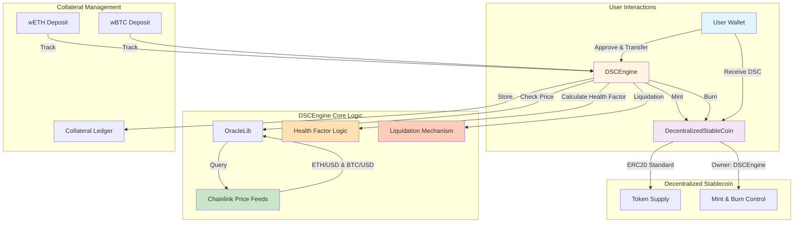
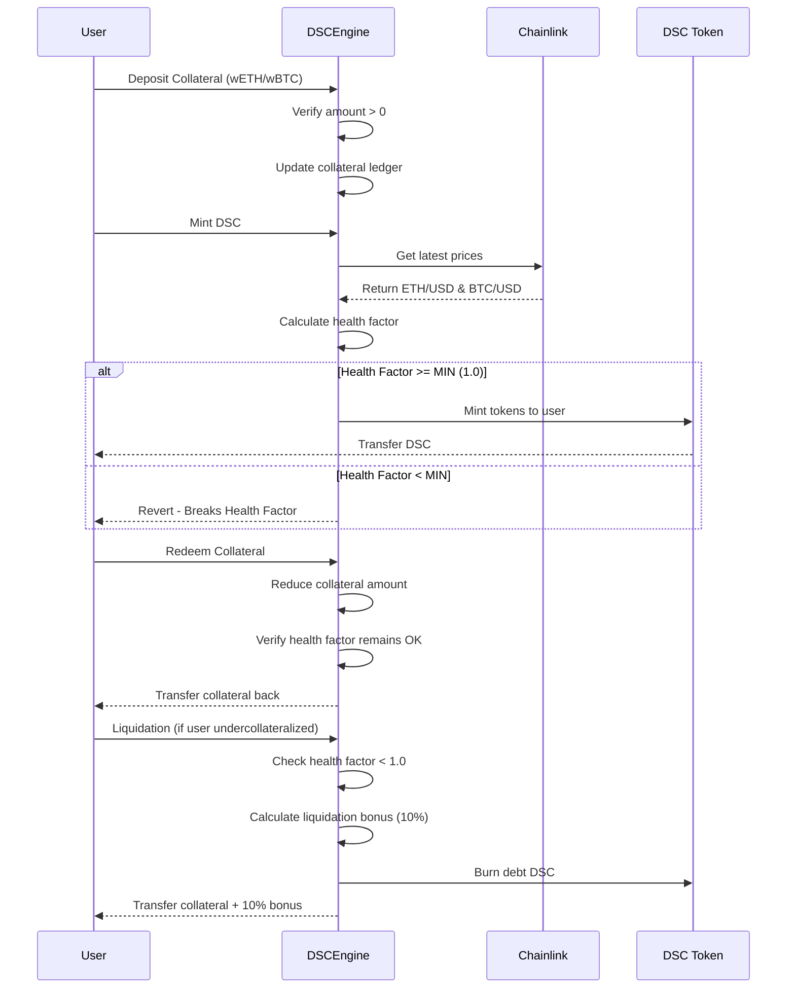

# Decentralized Stablecoin (DSC) System

## Project Overview

The **Decentralized Stablecoin (DSC)** system is a MakerDAO-inspired protocol that enables users to mint a USD-pegged stablecoin by depositing cryptocurrency collateral (wETH and wBTC). The system is fully decentralized, with no governance, no fees, and is backed only by exogenous crypto collateral.

### Key Characteristics

| Aspect | Description |
|--------|-------------|
| **Collateral Type** | Exogenous (wETH & wBTC) |
| **Minting Mechanism** | Algorithmic & Decentralized |
| **Price Stability** | Pegged to USD via Chainlink Price Feeds |
| **Collateralization** | Over-collateralized (200% minimum) |
| **Governance** | None (Decentralized) |
| **Fees** | None |

---

## System Architecture



---

## Core Contracts & Functions

### 1. **DecentralizedStableCoin.sol**
The ERC20 token contract representing the stablecoin itself.

**Key Functions:**
- `mint(address _to, uint256 _amount)` - Mint DSC tokens (only owner)
- `burn(uint256 _amount)` - Burn DSC tokens
- Inherits from `ERC20Burnable` and `Ownable`

### 2. **DSCEngine.sol**
The core engine managing collateral deposits, DSC minting, liquidations, and health factors.

**Key Functions:**

| Function | Purpose |
|----------|---------|
| `depositCollateral(address token, uint256 amount)` | Deposit wETH/wBTC as collateral |
| `mintDsc(uint256 amount)` | Mint DSC tokens against collateral |
| `depositCollateralAndMintDsc()` | Combined operation in one transaction |
| `redeemCollateral(address token, uint256 amount)` | Withdraw collateral (if health factor remains > 1) |
| `redeemCollateralForDsc()` | Burn DSC and redeem collateral in one transaction |
| `liquidate(address collateral, address user, uint256 debtToCover)` | Liquidate undercollateralized positions with 10% bonus |
| `getAccountCollateralValue(address user)` | Get total USD value of user's collateral |
| `getHealthFactor(address user)` | Calculate user's health factor |

**Health Factor Formula:**
```
Health Factor = (Collateral Value in USD × 50%) / DSC Minted
- If Health Factor < 1.0, position is liquidatable
- Minimum Health Factor = 1.0e18
```

### 3. **OracleLib.sol**
Library for secure Chainlink oracle price feed queries with stale price protection.

**Key Functions:**
- `staleCheckLatestRoundData(AggregatorV3Interface priceFeed)` - Fetches latest price with 3-hour staleness check

---

## Logic Flow Diagram



---

## State Variables & Architecture

### Mappings
```solidity
mapping(address token => address priceFeed) s_priceFeeds
mapping(address user => mapping(address token => uint256)) s_collateralDeposited
mapping(address user => uint256) s_dscMinted
address[] s_collateralTokens
```

### Constants
- `LIQUIDATION_THRESHOLD = 50` (200% collateralization)
- `LIQUIDATION_BONUS = 10%` (incentive for liquidators)
- `MIN_HEALTH_FACTOR = 1e18`
- `TIMEOUT = 3 hours` (price feed staleness threshold)

---

## Known Bugs and Vulnerabilities

This section documents known bugs, design limitations, and potential vulnerabilities in the DSC protocol.

### Critical Issues 🔴

| Bug ID | Title | Description | Impact | Status |
|--------|-------|-------------|--------|--------|
| **CRIT-001** | Liquidation Incentive Failure at 100% Collateralization | The protocol cannot incentivize liquidators when collateral value drops to ~100% of DSC debt. Liquidators expect a 10% bonus, but if collateral is only worth what's owed, there's no incentive to liquidate. This is a **known design limitation** acknowledged in the codebase comments. | Protocol becomes insolvent and unrecoverable | By Design |
| **CRIT-002** | No Emergency Pause Mechanism | There is no circuit breaker or pause functionality. If a critical oracle fails or a black swan event occurs, the protocol cannot halt operations. | Users could face forced liquidations during market chaos | By Design |
| **CRIT-003** | No Governance or Parameter Recovery | With no governance token or admin functions, parameters like `LIQUIDATION_THRESHOLD` or `LIQUIDATION_BONUS` cannot be adjusted. Recovery from crises is impossible. | Protocol parameters are immutable and permanent | By Design |

### High-Risk Issues 🟠

| Bug ID | Title | Description | Mitigation | Risk Level |
|--------|-------|-------------|-----------|-----------|
| **HIGH-001** | Oracle Single Point of Failure | Complete dependency on Chainlink price feeds. No fallback oracle or manual price mechanism. If Chainlink goes down, the protocol is frozen. | 3-hour staleness check provides some protection; best to monitor Chainlink status | High |
| **HIGH-002** | Flash Loan Attack Vector | While health factor checks provide some protection, liquidators could potentially use flash loans to inflate collateral prices and liquidate healthy positions. | ReentrancyGuard and health factor validation reduce risk; requires careful monitoring | High |
| **HIGH-003** | Liquidation Precision Issues | Due to integer division in USD conversion, small rounding errors could accumulate over many liquidations. | Precision constants (1e18, 1e10) chosen to minimize impact | Medium-High |

### Medium-Risk Issues 🟡

| Bug ID | Title | Description | Mitigation | Risk Level |
|--------|-------|-------------|-----------|-----------|
| **MED-001** | Limited Collateral Diversity | Only wETH and wBTC are supported. Lack of diverse collateral reduces protocol resilience. If both decline sharply, the system is vulnerable. | Collateral can be added via constructor; requires new deployment | Medium |
| **MED-002** | Price Feed Staleness = Frozen Protocol | If Chainlink prices don't update for >3 hours, the entire protocol halts. This is intentional but creates denial-of-service risk during market volatility. | By design; monitor Chainlink feed health | Medium |
| **MED-003** | No Redemption Slippage Protection | When redeeming collateral, there's no price slippage protection. Large redemptions could impact token prices. | Users must be aware of market impact | Medium |
| **MED-004** | Liquidation Bonus is Fixed | The 10% liquidation bonus is hardcoded and cannot be adjusted. In a prolonged bear market, this may be insufficient incentive. | Bonus is set conservatively (10%); markets typically overcome this | Medium |

### Low-Risk Issues 🟢

| Bug ID | Title | Description | Mitigation | Risk Level |
|--------|-------|-------------|-----------|-----------|
| **LOW-001** | Precision Loss on Exchange Rates | When converting between tokens and USD amounts, the integer division can cause precision loss. Amounts < 1 wei may round to zero. | Use large amounts (> 1 wei); typical for production | Low |
| **LOW-002** | Front-Running Liquidations | Liquidators could observe pending liquidation transactions and front-run them in the mempool. | Liquidators are incentivized anyway; priority gas auctions are standard in DeFi | Low |
| **LOW-003** | Unbounded Gas Costs | The `getAccountCollateralValue()` function loops over all collateral tokens. With many tokens, gas costs could exceed block limits. | Currently limited to 2 tokens (wETH, wBTC); should add token limit | Low |
| **LOW-004** | Health Factor = 0 Edge Case | If a user has zero collateral and zero DSC minted, `_healthFactor()` returns `type(uint256).max`. This is correct but an edge case. | Edge case handled correctly; returns max for safety | Low |

### Design Limitations (Not Bugs) ℹ️

| Limitation | Reason | Impact |
|-----------|--------|--------|
| **No Fee Collection** | Intentional design choice for decentralization | Protocol has no revenue; no incentive to maintain/upgrade |
| **No Governance** | Fully decentralized by design | Impossible to fix bugs or adjust parameters without redeploying |
| **Fixed Collateralization Ratio** | Enforced by constants; cannot be changed | Less flexibility compared to DAI's collateralization mechanisms |
| **Single Stability Peg** | Only USD; no alternative stability mechanisms | Vulnerable to systemic stablecoin failures in broader ecosystem |

---

## Security Strengths

| Feature | Benefit |
|---------|---------|
| **Reentrancy Protection** | ReentrancyGuard on all critical state-changing functions |
| **CEI Pattern** | Checks-Effects-Interactions pattern followed throughout |
| **Price Staleness Detection** | 3-hour timeout prevents stale oracle price usage |
| **Over-Collateralization** | 200% minimum collateralization provides cushion against volatility |
| **Automated Health Factor Checks** | All minting and redemptions validated against health factor |
| **Solidity ^0.8.20** | Automatic overflow/underflow protection |
| **ERC20 Standard Compliance** | Uses battle-tested OpenZeppelin implementations |

---

## Usage Example

```solidity
// 1. Deposit collateral
dscEngine.depositCollateral(wethAddress, 10 ether);

// 2. Mint DSC tokens (assuming WETH price is $2,000)
// Can mint up to $1,000 DSC (50% threshold = 200% collateralization)
dscEngine.mintDsc(1000e18);

// 3. Check health factor
uint256 healthFactor = dscEngine._healthFactor(userAddress);
// Returns: (10 ETH * $2,000 * 0.50) / 1000 DSC = 10 (very safe)

// 4. Redeem collateral
dscEngine.redeemCollateral(wethAddress, 5 ether);

// 5. Liquidate undercollateralized user
dscEngine.liquidate(wethAddress, undercollaterizedUser, 500e18);
// Liquidator receives: 500 worth of WETH + 10% bonus
```

---

## Testing & Coverage

The project includes comprehensive test coverage:

- **Unit Tests** ([DSCEngineTest.t.sol](test/unit/DSCEngineTest.t.sol)) - Tests for all core functions and edge cases
- **Fuzz Tests** ([Handler.t.sol](test/fuzz/Handler.t.sol)) - Property-based testing for protocol invariants
- **Invariant Tests** ([Invariant.t.sol](test/fuzz/Invariant.t.sol)) - Ensures system maintains key invariants

---

## Dependencies

- **OpenZeppelin Contracts** - ERC20, Ownable, ReentrancyGuard
- **Chainlink** - Price feed oracle contracts
- **Forge Std** - Foundry testing library

---

## Security Considerations

1. **Reentrancy** - Protected with ReentrancyGuard on deposit, mint, redeem, and liquidate functions
2. **Overflow/Underflow** - Solidity ^0.8.20 prevents arithmetic errors automatically
3. **Price Staleness** - OracleLib checks prices haven't exceeded 3-hour timeout
4. **Health Factor Validation** - All minting and redemptions validated against minimum health factor

---

## Future Improvements

1. Add governance token and voting mechanism for parameter adjustments
2. Implement stability fees or surplus buffer
3. Add more diverse collateral types (stablecoins, other assets)
4. Circuit breaker mechanism for emergency pause
5. Rate limiting on liquidations to prevent flash loan attacks
6. Multi-sig timelock for critical parameter changes
7. Integration with AMM protocols for better liquidation efficiency

---

